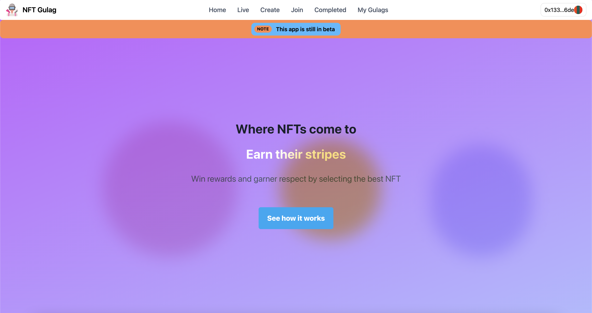
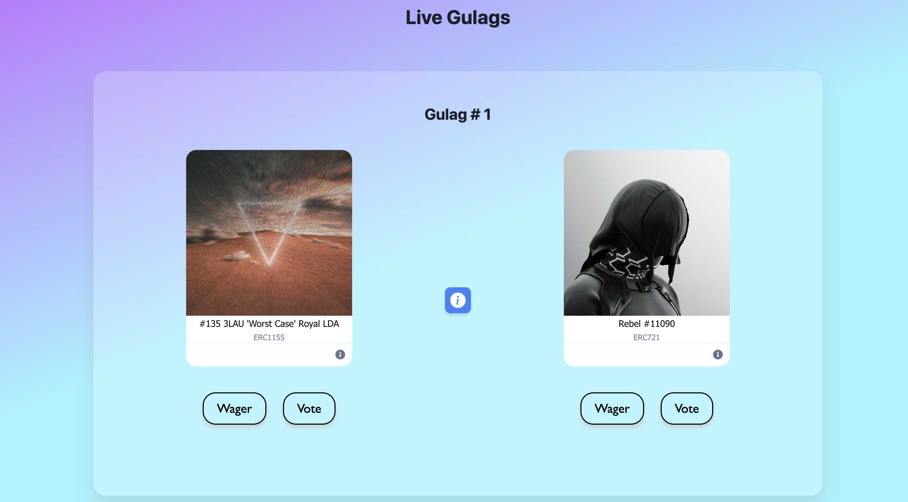

# NFT Gulag Dapp
This dapp utilizes the following frameworks: NextJS, React, Tailwind, and Typechain. To check out the live site, please visit [nftgulag.io](nftgulag.io).



And here is what the `Live Gulags` page looks like:



If you'd like to run this locally, please follow the guided steps below.

## Getting Started (Backend)

To begin, first install all dependencies by running the following:

```
npm i
# or
yarn
```

Then, store your `ABI` from your solidity contract in constant called `abi` inside the `<CONTRACT_NAME>__factory.ts` file under the `contracts/types/factory` folder. To see an example of how this is done, please check out the file `contracts/types/factory/ERC20__factory.ts` for an example of how this is done for an ERC20 contract. Run the following after finalizing your factory file:

```
npm run compile-contract-types
# or 
yarn compile-contract-types
```

This will create typescript types for your contract itself (which you can import using `useContract` ) as well as types for all variables/functions inside of your contract.
## Getting Started (Frontend)

To see your frontend NEXTJS web app, run the development server:

```bash
npm run dev
# or
yarn dev
```

Open [http://localhost:3000](http://localhost:3000) with your browser to see the result.

You can start editing the home page by modifying `pages/index.tsx`. The page auto-updates as you edit the file.